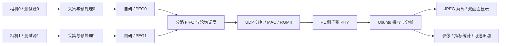

# 纯 FPGA + Ubuntu：嵌赛方案的 Xilinx 版本

日期：2026-09-17。按用户最新约束：只实现 FPGA 部分，ARM 应用不做，由 Ubuntu 主机承接展示及可选识别。本方案以完全不依赖 PS 数据通路作为比较基准。

**后续已确认：用户只有领航者 7010。** 下文保留三种板卡的比较依据；当前实施转到 [领航者 7010 方案](领航者7010实施方案.md)，以单路原型评估资源，未自动更改原双路最终验收目标。

## 阅读结论

原《技术方案 V3.0》的主体是双路各 1080p60，FPGA 采集、预处理、自研 JPEG 编码，压缩帧经 DDR/PCIe 交给 RK3576。本次保留自研编码和双路流式架构，将后端改为 Ubuntu，将首选传输改为千兆以太网。原方案的双路 60 fps 保留为性能目标，单路或较低分辨率仅用于分阶段联调，不视为最终性能已达标。

现有编码器可复用，但现有 RTL 仿真通过、安路物理时序通过、Xilinx 物理实现通过、真实摄像头上板通过是四种不同证据。原工程尚未覆盖完整的相机、DDR、PCIe 或网口系统。

## 两套板卡怎么选

以下硬件配置来自本地 V1.2 规格书，实物仍要核对 PCB 与核心板版本。领航者必须区分 7010 与 7020。

| 项目 | 达芬奇 ATK-DF7A35 | 领航者 7020 | 领航者 7010 |
| --- | --- | --- | --- |
| FPGA 型号 | XC7A35T FGG484 -2 | XC7Z020 CLG400 -2 | XC7Z010 CLG400 -1 |
| LUT | 20,800 | 53,200 | 17,600 |
| 触发器 | 41,600 | 106,400 | 35,200 |
| DSP48E1 | 90 | 220 | 80 |
| 36 Kbit BRAM | 50 | 140 | 60 |
| 板载 DDR3 | 256 MB、16 位，直连 FPGA | 1 GB、32 位，连接 PS | 512 MB、32 位，连接 PS |
| 不用 PS 时的大容量外部缓存 | 可以使用板载 DDR3，需 MIG 和仲裁 | 不能直接使用板载 PS DDR | 同左 |
| 本任务可用网口 | FPGA 侧千兆口 | PL 侧千兆口 | PL 侧千兆口 |
| 标准相机接口 | 一组 8 位 DVP | 一组 8 位 DVP | 一组 8 位 DVP |
| HDMI | 两路，资料说明可输入/输出 | 一路输出，资料标注最高 1080p30 | 同左 |

资源数量按 AMD DS180、DS190 核对，避免将宣传中的 Logic Cells 当作 LUT 数；安路 ERAM/DSP 数量也不能直接换算成 Xilinx 原语数量。

### 本次实际综合结果

Vivado 2020.1、`mjpeg_synth_top`、双路、`MAX_WIDTH=1920`，只统计编码与现有调试封装，不含相机、预处理、MAC、DDR 控制器或 ILA。

| 资源 | 达芬奇 A35T 使用量 / 容量 | 领航者 7020 使用量 / 容量 |
| --- | ---: | ---: |
| LUT | 21,873 / 20,800（105.16%） | 20,805 / 53,200（39.11%） |
| FF | 31,791 / 41,600（76.42%） | 31,287 / 106,400（29.41%） |
| BRAM Tile | 42 / 50（84.00%） | 49 / 140（35.00%） |
| DSP48E1 | 84 / 90（93.33%） | 84 / 220（38.18%） |

A35T 的 DRC 已报告两项 `UTLZ-1` 资源超限。物理优化可能改变 LUT 数量，但即使把现有模块压入芯片，完整系统仍缺乏余量。因此当前双路方案明确优先 **领航者 7020 的 PL + 千兆以太网 + Ubuntu**。达芬奇适合作为单路路线另行评估，不承诺当前双路工程可直接落板。

两次综合的 RAM 映射策略不同，不把 BRAM 数差异当作算法差异。以上是 OOC 综合统计，未布局布线；7020 在 5 ns 时钟下的综合后时序估算 WNS 为 -1.352 ns，需要继续进行针对 Xilinx 的时序优化，不能沿用原安路的 200 MHz 通过结论。OOC 中时钟在综合完成后添加用于报告，资源比较不代表按该时钟完成了时序收敛。

原始报告：[7020 双路](../reports/synth_xc7z020clg400-2_2ch_1920px_20260917_215152/utilization.rpt)、[A35T 双路](../reports/synth_xc7a35tfgg484-2_2ch_1920px_20260917_215239/utilization.rpt)。

补充的 [达芬奇单路综合](../reports/synth_xc7a35tfgg484-2_1ch_1920px_20260917_215828/utilization.rpt) 使用 10,120 LUT（48.65%）、16,205 FF（38.95%）、24.5 BRAM Tile（49.00%）和 42 DSP（46.67%），没有资源超限类 DRC 错误。它为单路系统留下了可用余量，但加上 MIG、网口和预处理后仍要重新统计，5 ns 综合后 WNS -1.347 ns 也尚未解决。

选型侧重点：

- **双路编码和更多预处理逻辑：优先考察领航者 7020 的 PL。** 使用它并不意味着必须开发 ARM 应用；可由板上 PL 50 MHz 晶振产生工作时钟，经 PL 网口直连 Ubuntu。调试采用 JTAG 配置 PL，启动方式单独处理。
- **纯 FPGA 的 DDR 缓存、单路完整闭环：达芬奇更直接。** 有直接连接的 DDR 与网口，但 A35T 的逻辑、DSP、BRAM 都较少，必须先看双编码器加 MAC、预处理、FIFO、ILA 后是否放得下。
- **领航者 7010 不作为双路完整系统的优先选择。** 它的 PL 比 A35T 更小，同时没有纯 PL 可直接使用的板载 DDR。

不因达芬奇是纯 FPGA 板就自动选达芬奇，也不把领航者的 1 GB PS DDR 计入完全不用 PS 的方案。若任务必须在 FPGA 侧缓存多帧或承受链路长时间停顿，DDR 拓扑将成为硬约束。

## 与 Ubuntu 的连接

FPGA 负责相机配置、采集 CDC、预处理、JPEG、缓存、分包、CRC/FCS、MAC、PHY 配置及帧统计。Ubuntu 负责网络接收、分片重组、JPEG 解码、双画面显示、存储和可选识别。第一阶段使用独立有线千兆链路和固定地址，避免把交换网络配置混入编码调试。

领航者严格不用 PS 时，只使用 PL 网口；PS 网口、PS USB、eMMC 和 PS DDR 都不能按普通 PL 外设直接使用。即使不运行 ARM 应用，若要通过 AXI HP 访问 PS DDR，仍需要 PS DDR/时钟/互连初始化，这是另一种约束下的方案，本版不把它作为默认路径。

不优先复刻原 PCIe：两套现成底板没有作为本方案接入基础的板载 PC PCIe 接口，芯片系列支持某功能不代表底板引出了可直接连接的接口。达芬奇 FT232H 可考虑作为较低码率或离线测试通道；其官方同步 FIFO 传输规格上限为 40 MB/s，不能把 USB 2.0 的 480 Mb/s 标称值当作持续 JPEG 负载能力。

## 带宽、缓冲与协议

双路各 1080p60 的 YUV422 有效像素负载：`1920×1080×2×60×2 = 497,664,000 B/s`，约 3.98 Gb/s。因此不能把完整双路原始视频通过一条千兆网线持续送入 Ubuntu，压缩必须发生在 FPGA 内。

原回归样本每帧 JPEG 为 516,557 字节。按两路各 60 fps 算得 JPEG 负载约 61.99 MB/s，即 495.9 Mb/s；这是一个样本的算术预算，非所有场景的上限。千兆链路需扣除以太网/IP/UDP及自定义帧头开销，画面噪声、量化质量和输出突发要实测。

原调试格式每 16 字节 JPEG 附加 8 字节头，约 50% 的额外数据量。网络实现优先直接接内部 128 位接口，以约 1400 字节 JPEG 数据为一片，保持 IP 包在普通 1500 MTU 内。必要字段包括版本、通道、帧号、分片序号或偏移、分片长度、首末标志、配置版本；最终长度、时间戳、帧状态和 CRC 随帧描述发送。字段宽度与字节序在实施前固定。

JPEG 长度只有帧结束后才完整确定，无需为了提前填长度而缓存整个 JPEG：先流式发送数据片，帧结束再发描述。Ubuntu 按通道/帧号/偏移重组，等描述、所有字节和校验齐全再交付。丢片、乱序、重复、超时和错误帧应有明确处理；UDP 本身不保证可靠传输。不能直接宣称自定义 UDP 流可由 VLC 播放，应先用专用接收程序解包，或另做标准 RTP/JPEG 封装。

片内 FIFO 只吸收短时突发，不能取代多帧 DDR：即使拿全部 140 块 36 Kbit BRAM 做队列也仅约 630 KiB，还要扣除编码器行缓存、DCT 等用量。以示例 JPEG 总码量计，50 ms 链路停顿会积压约 3.10 MB，片内缓存明显不足。Ubuntu 的内存可承担前后录和应用队列，但不能消除 FPGA 到网卡这段链路的拥塞。

本次 7020 双路综合使用 49 个 BRAM Tile，理论上剩余 91 个、约 409.5 KiB；尚未扣除 MAC、预处理和其它 FIFO。这甚至小于测试样本中的一张 516,557 字节 JPEG，因此推荐边编码边分片发送，不依赖在 FPGA 内保存完整压缩帧。

因此领航者纯 PL 版本应持续发送，由 Ubuntu 接收线程及时搬运数据，解码、显示和录像分开排队。以实际最坏码量和最长网络停顿核算 FIFO，溢出要上报并废弃整帧；异常恢复不等于满足正常负载下的无丢帧指标。如果要求在 FPGA 侧无损承受 50 ms 停顿，就需要能接入的大容量外部缓存或调整系统条件。

## 摄像头与演示范围

两块板的标准相机接口都只有一组，不能把拥有一块开发板等同于已具备双路相机接入。第二路需要核对扩展口、时钟输入脚、电平、接线和相机模块；双目附件的共享总线与并发能力也要单独核实。

常见 OV5640 标称 1080p30、720p60，不能作为双路 1080p60 的真实输入证明。8 位 DVP 输出 YUV422 时每像素要传两字节，PCLK、有效视频比例和模块配置还会进一步约束吞吐。若最终坚持 1080p60，应选择真正支持该模式的输入源，并验证对应接收电路。现阶段可用两路不同内容的片内图样源验证编码吞吐，用现有相机验证实际链路；不能把两者混为同一个上板性能结果。

## 实施顺序与验收

1. 完成 Xilinx RAM 适配、原编码器回归和目标器件资源评估。保持原算法及数据接口稳定。
2. 板上两路图样源接 JPEG；ILA/计数器观察握手、帧号、字节数与错误。工作频率以整机布局布线为准。
3. 先让 PL 网口发计数包，再传已知 JPEG，然后接入实时编码。Ubuntu 分路显示并统计缺片、CRC、编码/接收帧数、平均/峰值码率。
4. 替换为真实相机，增加采集 FIFO、CDC、溢出处理。逐步合入灰度、高斯滤波、亮度均衡；每路算法状态独立。
5. 在明确输入、画质、链路和缓存条件下完成双路持续测试；原目标是每路 60 fps、正常负载至少两小时无丢帧。Ubuntu 可添加处理前后对比、录像和识别展示。

目前不能承诺整板 200 MHz 或双路真实 1080p60；需要最终引脚约束、完整资源、实现时序与实测结果。板卡实物版本和现有相机型号仍待确认。

## 依据

- [技术方案 V3.0](F:/zju/嵌赛/比赛文件/output/安路选题三/技术方案_V3.0.md) 与 [原编码器接口](F:/zju/qiansai_FPGA/jpeg_encoder/docs/MJPEG接口.md)。
- [原工程时序优化记录](F:/zju/qiansai_FPGA/jpeg_encoder/reports/时序优化记录.md)：安路专属历史数据，未代替本次验证。
- [达芬奇规格书 V1.2](F:/zju/【新资料-Vivado_2020.2-已完结】达芬奇FPGA开发板资料盘（A盘）/3_开发板原理图和硬件相关文件/硬件相关文件/开发板规格书/【正点原子】达芬奇FPGA开发板规格书V1.2.pdf)：第 7～9、16、18～19 页。
- [领航者规格书 V1.2](F:/zju/正点原子领航者(V2)ZYNQ开发板资料盘(A盘)/3_开发板原理图和硬件相关文件/硬件相关文件/开发板规格书/【正点原子】领航者ZYNQ开发板规格书V1.2.pdf)：第 7、9～11、31、33～35 页。
- [AMD DS180](https://docs.amd.com/api/khub/documents/2LByHkO~nSZXcei2D55fTg/content)、[AMD DS190](https://docs.amd.com/v/u/en-US/ds190-Zynq-7000-Overview)：器件资源。
- [AMD RAM_STYLE](https://docs.amd.com/r/en-US/ug912-vivado-properties/RAM_STYLE)：块 RAM 推断属性。
- [AMD PL 配置路径](https://docs.amd.com/r/en-US/ug585-zynq-7000-SoC-TRM/PL-Configuration-Paths)、[DDR 初始化](https://docs.amd.com/r/en-US/ug585-zynq-7000-SoC-TRM/DDR-Initialization-Sequence)。
- [OmniVision OV5640 官方说明](https://www.ovt.com/wp-content/uploads/2021/01/OV5640_PressRelease_Final.pdf)：相机标称帧率。
- [FTDI FT232HL](https://ftdichip.com/products/ft232hl/)：同步 FIFO 接口能力。
